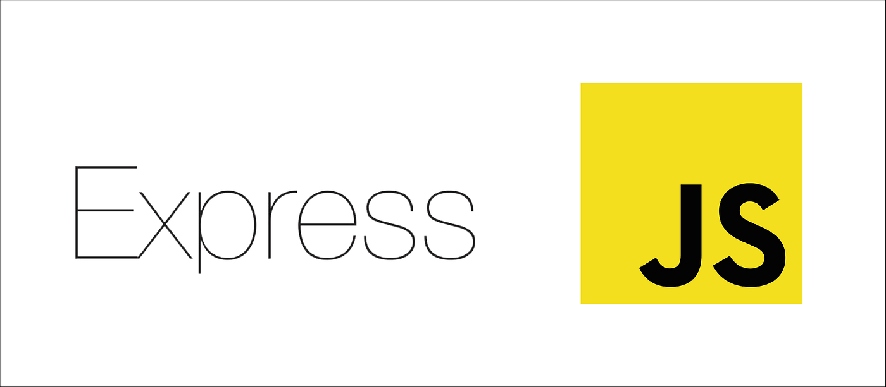

# Nursultan's GitHub Portfolio

Welcome to my GitHub portfolio! I'm Nursultan, a dedicated backend developer with 1 year of experience. Below, you'll find information about me, my skills, and the tools I use. Feel free to explore my repositories and projects.

## About Me

I'm passionate about creating robust and efficient backend solutions. My journey in the world of programming started a year ago, and since then, I've been continuously learning and improving my skills. I love working with cutting-edge technologies to build scalable and high-performance applications.

## Contact

## My Tools

Here are the technologies and tools I work with:

- HTML 
- CSS 
- Bootstrap 
- Node.js 
- Express.js 
- MongoDB 
- JavaScript 
- Vue.js 

Feel free to reach out if you have any questions, suggestions, or collaboration opportunities. I'm always open to new challenges and exciting projects.

Thank you for visiting my GitHub profile!

Happy coding! 🚀
